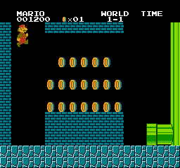

Here’s an extended description for **Template Matching** with added images section:

---

### 🖼️ Template Matching

## 🚀 About
**Template Matching** is a computer vision project that uses advanced image processing techniques to identify and match specific templates within images. This project leverages the power of `OpenCV` to efficiently detect objects or patterns in images by matching them with a predefined template. It is highly accurate and useful for various real-world applications such as object detection, image recognition, and automation. 🖼️🔍

## ⚡ Features
- **🔍 Image Template Matching**: Detect objects or patterns within images using a predefined template, allowing for quick recognition of specific items.
- **⚙️ OpenCV Integration**: Harnesses the power of OpenCV’s image processing tools to perform precise template matching.
- **📈 High Accuracy**: Ensures reliable detection of objects, minimizing false positives and improving the accuracy of matches.
- **💡 Versatile**: Can be applied in various fields such as robotics, security, and image analysis.

## 🛠️ How to Run

### 📋 Requirements
- Python 3.x
- Libraries: `opencv-python`, `numpy`

### 💻 Installation

1. **Clone the repository**:
   ```bash
   git clone https://github.com/MohamedBoghdaddy/-Template-Matching.git
   cd Template-Matching
   ```

2. **Install dependencies**:
   ```bash
   pip install -r requirements.txt
   ```

3. **Run the script**:
   ```bash
   python template_matching.py
   ```

## 📸 Screenshots

### Template Matching in Action:

_Matching a specific template in an image using OpenCV._


_Another example of template matching for object detection._

## 🤝 Contributing
We welcome contributions! Feel free to contribute by improving the algorithm, adding new features, or optimizing the code for better performance.

1. Fork the repository.
2. Create a new branch for your feature.
3. Push your changes and open a pull request.

